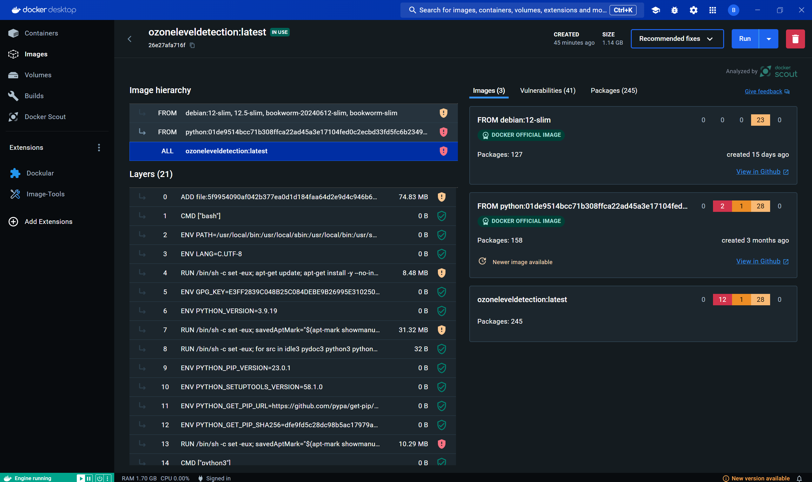
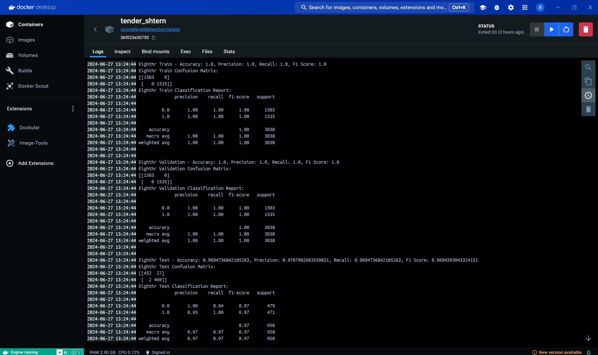

## Tools Overview

### Google Cloud Storage (GCS)
Google Cloud Storage (GCS) is a scalable object storage service designed for storing and retrieving data from anywhere on the web. It provides high availability, durability, and seamless integration with other Google Cloud services. GCS supports features like versioning, encryption, and fine-grained access controls, making it ideal for storing large datasets, backups, and multimedia content securely.

### Apache Airflow
Apache Airflow is an open-source platform used for orchestrating complex workflows and data processing pipelines. It allows users to define workflows as Directed Acyclic Graphs (DAGs), where each node represents a task that can execute independently or in relation to other tasks. Airflow provides scheduling, monitoring, and alerting capabilities, making it suitable for managing ETL processes, machine learning pipelines, and data warehousing tasks efficiently.

### Vertex AI
Vertex AI is a managed machine learning (ML) platform on Google Cloud. It simplifies the process of building, training, and deploying ML models at scale. Vertex AI supports AutoML for automated model training, custom model training using TensorFlow or PyTorch, and deployment of models via endpoints for online prediction. It integrates seamlessly with Google Cloud services like BigQuery and AI Platform Notebooks, providing a comprehensive environment for ML development and deployment.

### MLflow
MLflow is an open-source platform for managing the end-to-end machine learning lifecycle. It provides tools for tracking experiments, packaging code into reproducible runs, and managing model deployments across different environments. MLflow supports multiple ML libraries and frameworks, facilitating collaboration and reproducibility in ML projects. It is commonly used for experiment tracking, model versioning, and production deployment.

### Flask API
Flask API refers to creating APIs using Flask, a lightweight web framework for Python. Flask enables developers to build RESTful APIs quickly and efficiently. It offers features like routing, request handling, JSON serialization, and integration with various data sources. Flask API development is straightforward and flexible, making it popular for building microservices and integrating machine learning models into web applications or cloud services.

### Docker
Docker is used for containerizing applications, providing a consistent environment across development, testing, and production. It simplifies deployment by packaging applications and their dependencies into containers, ensuring portability and scalability. Docker images are used to encapsulate machine learning models, Flask APIs, and other components within this project, enabling seamless deployment on Google Cloud Platform.

## Deployment Guide on Google Cloud Platform

### Introduction
This guide outlines the deployment process for a machine learning pipeline on Google Cloud Platform (GCP). The pipeline utilizes various GCP services including Google Cloud Storage (GCS), Cloud Composer (Apache Airflow), Docker, MLflow, Vertex AI, and Flask API.

### Initial Setup

#### Google Cloud SDK
1. **Download the Google Cloud SDK:**
   - Extract the tar.gz file into your directory creating a folder named "google-cloud-sdk".
   - Navigate to the folder and run: `./google-cloud-sdk/install.sh`.

2. **Configure gcloud:**
   - For Windows Users:
     ```
     source ./google-cloud-sdk/path.bash.inc
     source ./google-cloud-sdk/completion.bash.inc
     ```
   - For Mac Users:
     ```
     source ./google-cloud-sdk/path.zsh.inc
     source ./google-cloud-sdk/completion.zsh.inc
     ```
   - Verify installation: `gcloud --version`.

#### Identity Access Management (IAM)
1. **Create a Service Account:**
   - Go to IAM & Admin > Service Accounts > Create a service account.
   - Assign roles (e.g., Compute Engine Service Agent, Cloud Storage Admin).

#### Cloud Storage Setup
1. **Create Cloud Storage Buckets:**
   - Navigate to Cloud Storage > Create buckets:
     - `artifacts-bucket`: Main bucket for project artifacts.
     - `metadata-store-bucket`: Bucket for metadata files.
     - `training-bucket`: Bucket for training data.
     - `testing-bucket`: Bucket for testing data.
   - Define a structured folder hierarchy in `artifacts-bucket` for data stages.

#### Environment Setup
1. **Service Account Access Key:**
   - Generate a key: IAM & Admin > Service Accounts > Manage keys > Add key > Create new key (JSON).
   - Rename to `gcp-key.json` and keep secure.

2. **Authentication and Configuration:**
   - Authenticate gcloud: `gcloud auth login`.
   - Set project ID: `gcloud config set project <project-id>`.
   - Configure Docker with gcloud: `gcloud auth configure-docker us-east1-docker.pkg.dev`.
   - Activate service account: `gcloud auth activate-service-account --key-file=gcp-key.json`.

3. **Environment Variables (.env files):**
   - Create `.env` files for containers:
     ```dotenv
     GOOGLE_CLOUD_PROJECT=<your-google-cloud-project-id>
     AIPLATFORM_LOCATION=<location-of-your-Vertex-AI-cluster>
     GCP_CREDENTIAL_PATH=<relative-path-to-gcp-key.json>
     SERVING_CONTAINER_URI=<path-to-serving-container>
     AIPLATFORM_EXPERIMENT=<experiment-name>
     AIPLATFORM_BUCKET=<artifact-bucket-path>
     ```

### Deployment on Vertex AI
Deploying models on Vertex AI leverages Google Cloud's managed services for scalable and efficient model deployment. Vertex AI simplifies the process of managing and serving machine learning models, providing robust infrastructure for both training and inference.

#### Vertex AI Overview
Vertex AI offers:
- Managed Services: Easily deploy and manage machine learning models using Vertex AI's managed services, which include automated scaling and high availability.
- Model Deployment: Seamlessly deploy trained models as endpoints for online prediction using a variety of container environments.
- Integration with Google Cloud: Integrate Vertex AI with other Google Cloud services like Cloud Storage for model artifact storage and BigQuery for data analytics.
- Monitoring and Logging: Monitor model performance and usage metrics, with built-in logging for better insights and troubleshooting.

#### Airflow Integration
Using Apache Airflow:
- Orchestration: Orchestrate the end-to-end workflow for training, evaluation, and deployment of machine learning models on Vertex AI.
- Task Automation: Automate tasks such as model training, validation, artifact management (e.g., uploading/downloading models from Cloud Storage), and deployment.
- Scalability: Utilize Airflow's scalability to handle complex DAGs and schedule tasks effectively, ensuring timely model updates and deployments.

#### Deployment Workflow
1. **Model Training and Evaluation:**
   - Train machine learning models using Python operators in Airflow. Evaluate model performance using metrics like accuracy, precision, recall, and F1-score.

2. **Artifact Management:**
   - Manage model artifacts using Google Cloud Storage. Upload trained models and metrics to designated GCS buckets for storage and versioning.

3. **Deployment to Vertex AI:**
   - Deploy trained models to Vertex AI using Python operators in Airflow. Specify model configurations, container environments, and endpoint settings directly from Airflow tasks.

4. **Monitoring and Notifications:**
   - Monitor deployment status and performance metrics. Set up alerts and notifications using Airflow's email operators to notify stakeholders upon successful deployment or in case of errors.

## Docker Containerization

### Overview
Docker is utilized to containerize the machine learning model for streamlined deployment and execution in a consistent environment. Containerization with Docker ensures portability, scalability, and reproducibility of the model application across different computing environments.

### Dockerfile Explanation

#### Base Image
The Dockerfile begins by using the official Python image (`python:3.9-slim`) from Docker Hub as the base image. This image provides a lightweight and optimized Python runtime environment.

#### Working Directory
Sets the working directory (`/app`) within the Docker container where all subsequent commands will be executed.

#### Dependencies Installation
Copies the `requirements.txt` file from the local machine into the container at `/app` and installs all specified dependencies using `pip`. The `--no-cache-dir` flag ensures that no cached packages are used, reducing the final image size.

#### Application Code
Copies all the contents of the local directory into the container's `/app` directory. This includes the machine learning model code (`Randomforest_model_print.py`) and any other necessary application files.

#### Service Account Key
Copies the service account key (`ozone-level-detection-0160dba47662.json`) into the container at `/app`. This key is used for authentication and accessing Google Cloud services securely from within the Docker container.

#### Command Execution
Specifies the command (`CMD ["python", "Randomforest_model_print.py"]`) to execute when the Docker container starts. This command runs the Python script that contains the machine learning model logic (`Randomforest_model_print.py`), initiating the model's functionality within the Dockerized environment.




### Deployment Considerations
- **Environment Consistency:** Docker ensures that the machine learning model behaves consistently across development, testing, and production environments.
  
- **Dependency Management:** Dependencies are managed within the Docker container, minimizing compatibility issues and ensuring reproducibility of the model's execution environment.

- **Scalability:** Docker containers can be easily scaled horizontally to handle increased workload demands, facilitating efficient deployment in production environments.

---
