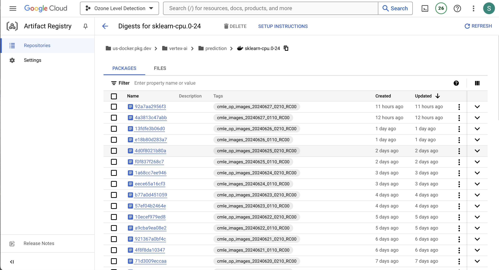
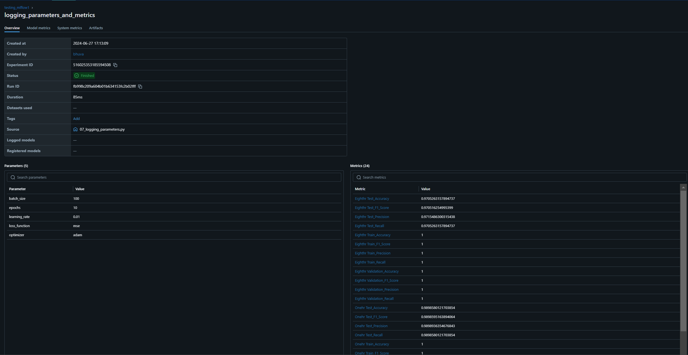
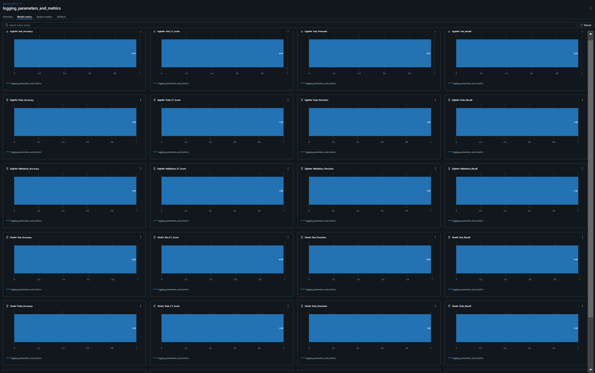

# Monitoring Flow for Data Processing and Model Deployment Pipeline

## 1. Data Processing with Airflow DAGs
**Objective:** Ensure timely execution and monitoring of data processing tasks.

**Monitoring Points:**
- Task Status: Monitor the status of each task in Airflow DAGs to ensure they complete successfully.
- Task Duration: Track the time taken by each task to identify bottlenecks or delays.
- Data Quality Checks: Implement checks within DAGs to verify data quality (e.g., schema validation, missing values).
- Error Handling: Set up alerts for task failures or errors to take proactive action.

**Implementation:**
Define DAGs in Airflow that orchestrate data processing tasks, ensuring dependencies are managed and tasks execute in the correct sequence.

## 2. Model Training and Deployment with Docker and Vertex AI
**Objective:** Monitor the end-to-end process of model training, evaluation, and deployment.

**Monitoring Points:**
- Model Training Metrics: Capture metrics such as accuracy, precision, recall during model training.
- Artifact Versioning: Ensure proper versioning and storage of trained models and artifacts in Google Cloud Storage (GCS).
- Deployment Status: Monitor the status of model deployment to Vertex AI endpoints.
- Resource Utilization: Track resource consumption (CPU, memory) during model training and deployment.

**Implementation:**
- Use Docker for containerizing your machine learning model and Flask/FastAPI applications.
- Integrate with Vertex AI for model deployment and management.
- Implement logging and metrics collection during training and deployment phases. We used personal mail ID and SMTPLIB for email alerts in DAG. We also implemented logging.

## 3. Integration with Flask API and FastAPI
**Objective:** Monitor the performance and availability of APIs serving machine learning models.

**Monitoring Points:**
- API Response Time: Measure the response time for API endpoints.
- Endpoint Availability: Monitor uptime and availability of Flask API and FastAPI endpoints.
- Request Rate: Track the rate of incoming requests to ensure scalability and performance.
- Error Rates: Monitor error rates and exceptions thrown by API endpoints. We are monitoring the metrics of the model using Flask API.

**Implementation:**
- Deploy Flask API and FastAPI endpoints that interface with your machine learning models deployed on Vertex AI.
- Use logging frameworks like logging in Python to capture application logs and metrics.
- Implement health checks and status endpoints within Flask and FastAPI applications for monitoring.
- 
## Execution using MLflow
For managing the end-to-end machine learning lifecycle, including experiment tracking, reproducibility, and model versioning, we use MLflow. MLflow helps us streamline experimentation, track model parameters and metrics, and easily reproduce models for deployment.

## Example Monitoring Tools and Techniques
- **Logging and Alerting:** Use Cloud Monitoring in Google Cloud Platform for real-time monitoring and alerting based on custom metrics and logs.
- **Dashboarding:** Create dashboards in tools like Google Cloud Console or Grafana to visualize metrics and performance indicators across your pipeline.
- **Automated Notifications:** Set up email alerts or integrate with Slack or other notification services to notify stakeholders of critical events or anomalies.
